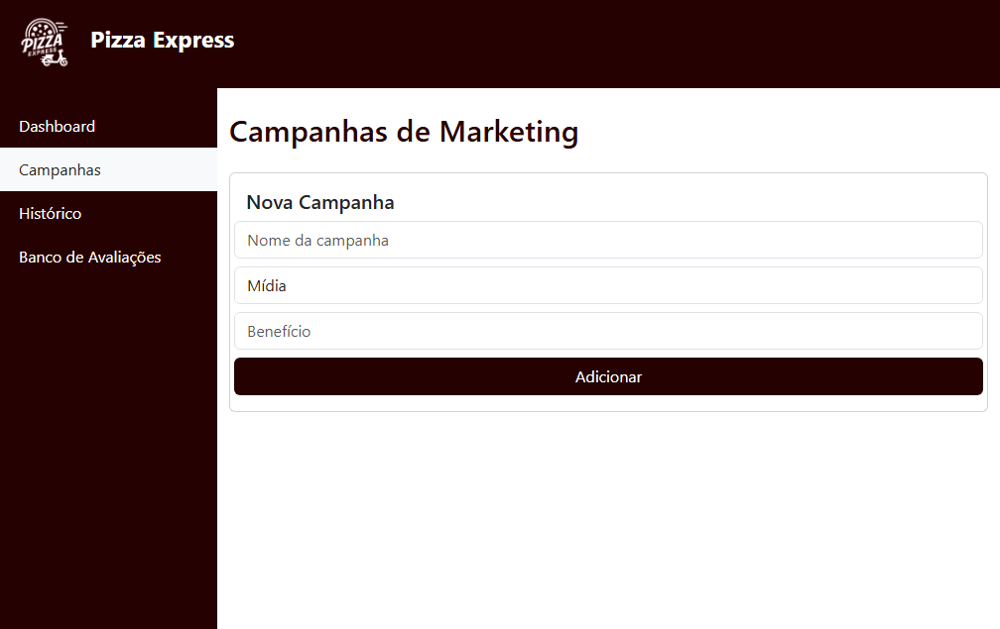

# CRM Pizzaria

Sistema de gerenciamento de relacionamento com o cliente (CRM) voltado para pizzarias, desenvolvido com Spring Boot no backend e React JS no frontend. A aplicação tem como foco facilitar a gestão de motoboys, campanhas promocionais e avaliações de desempenho.

## Funcionalidades

- Cadastro de usuários  
- Cadastro de motoboys  
- Histórico de avaliações 360° (clientes e entregadores)  
- Visão administrativa da pizzaria com banco de avaliações  
- Criação e gerenciamento de campanhas promocionais    

## Tecnologias Utilizadas

### Backend

- Java 17  
- Spring Boot  
- Spring Data JPA  
- PostgreSQL  

### Frontend

- React JS  
- Bootstrap 5.3.3  
- React Router DOM  
- Axios  


## Como Executar

1. Clone o repositório:

```
git clone https://github.com/seu-usuario/crm-pizzaria.git
```

2. Configure as credenciais do banco de dados PostgreSQL no arquivo `application.properties` do backend.

3. Inicie o backend:

```
cd backend
mvn spring-boot:run
```

4. No diretório do frontend, instale as dependências:

```
cd frontend
npm install
```

5. Inicie o frontend:

```
npm start
```

<div style="display: flex; gap: 10px; justify-content: center;">
  
  
</div>
